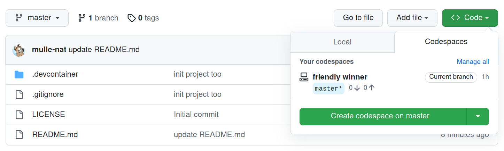
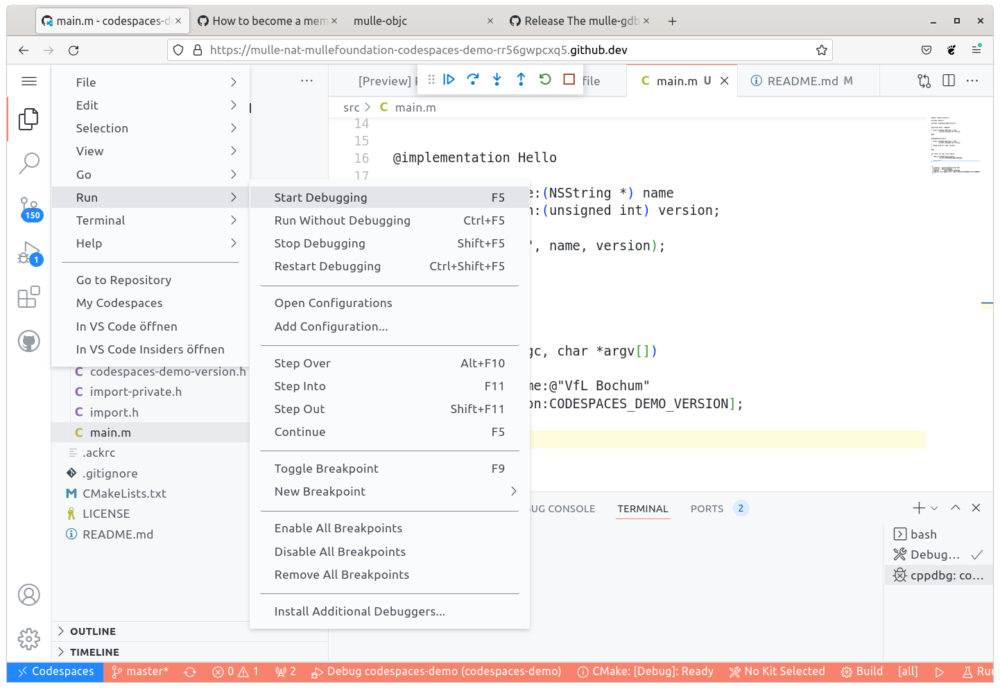

# codespaces-demo

🎌 Codespace for developing a mulle-objc executable

This project sets up a github codespace with [foundation-developer](//github.com/MulleFoundation/foundation-developer).
In that codespace there will be a [mulle-objc](//mulle-objc.github.io/)
project of a simple executable. The codespace will contain:

* [mulle-sde](//github.com/mulle-sde)
* [mulle-clang](//github.com/mulle-cc/mulle-clang)
* [mulle-gdb](//github.com/mulle-cc/mulle-gdb)
* [MulleFoundation](//github.com/MulleFoundation)

This codespace demo uses a hosted image, instead of creating the docker container from scratch. A side effect of
this is, that you can not use it locally with "Remote Containers".

## How To Create The Codespace

If you have [codespaces](https://github.com/features/codespaces) enabled on github, you should see the
"Create codespace on master" button (see pic). If you don't have codespaces, you can apply for a [beta membership](https://github.com/features/codespaces/signup) as an individual or use the "Run locally" method.

**Beware**, the preparation of the Codespace can take a few minutes.
Also check the github pricing, as Codespaces may encur costs (post-beta).

### Debug The Project

Once the container has been built, you will be in a Visual Studio Code environment, running in your
browser. You can now build and debug the project:

